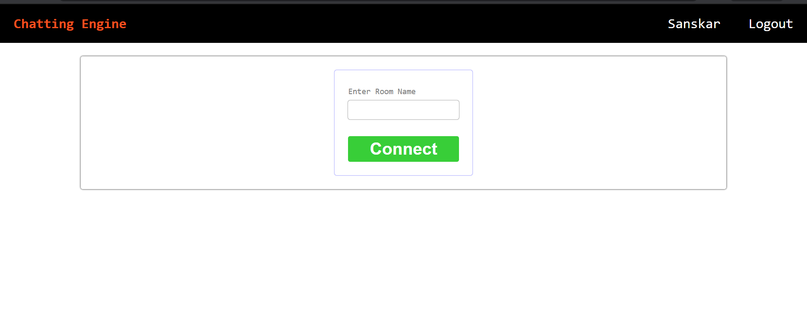
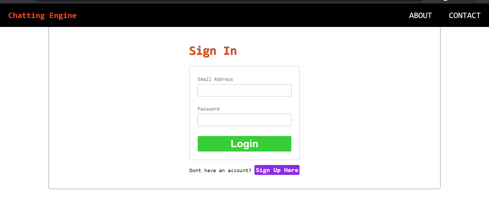

# chatting_app
Chatting app using express, passport, nodemailer, socket.io, ejs.

.
.
***
Commands to run:
***
1.) Install packages using below command.  
```
npm install 
```
2.) Install nodemon first or change the start from package.json to node 'index.js'
```
npm start
```

